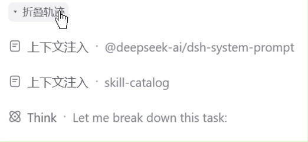
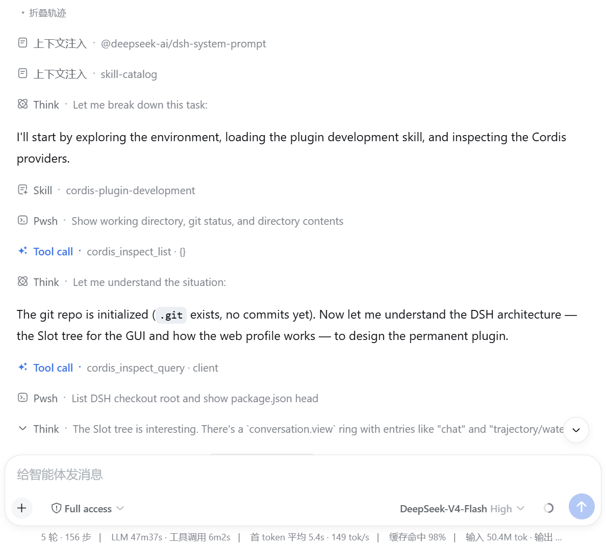
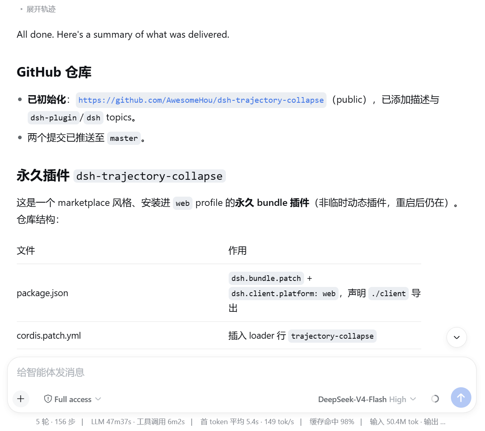
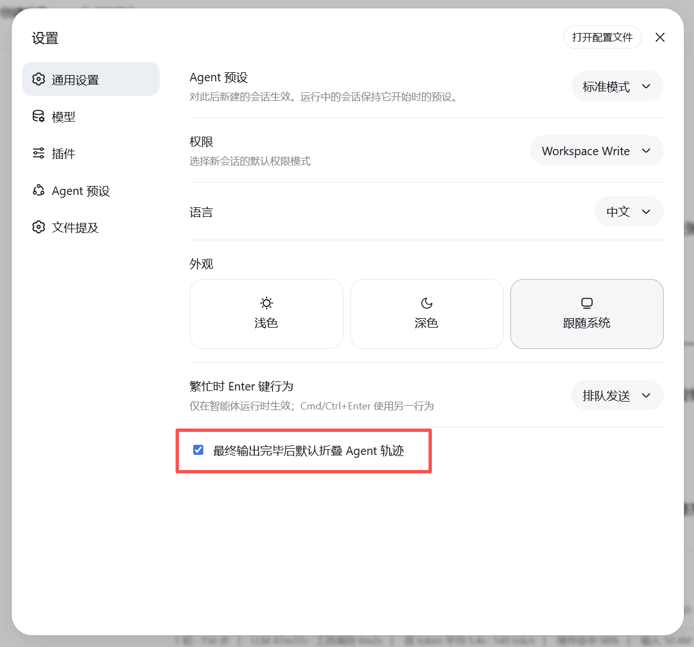

# dsh-trace-collapse

一个 DeepSeek Harness **Web 界面** 永久插件：可以折叠 Agent 的轨迹（中间的思考步骤、工具调用、steering、workflow 运行、上下文注入等），同时**始终保留 Agent 的最终输出**。

English: [README.en.md](README.en.md)

## 演示



折叠前，完整的 Agent 轨迹（思考、工具调用、上下文注入）都可见；点击轨迹顶部的「Collapse trace」按钮后，只保留用户提问与 Agent 的最终输出，需要时随时可以展开。

| 折叠前（轨迹展开） | 折叠后（仅保留最终输出） |
| --- | --- |
|  |  |

## 功能

- **逐轮次折叠 Agent 轨迹** — 折叠是**以轮次为单位**的：每个已完成的 Agent 输出顶部都有一个克制的 `Expand trace / Collapse trace` 小按钮，你可以单独控制每一次输出的轨迹折叠。该按钮位于轨迹上方、用户消息下方，且只出现在确实有轨迹可折叠的轮次。
- **始终保留最终输出** — 即使折叠后，用户消息与收尾的助手输出也始终可见；只有中间的轨迹被隐藏。
- **可折叠的轨迹类型** — 工具调用（`tool-call`）、思考步骤（非最终的 `assistant-step`）、steering、workflow 运行、上下文注入行（`context`，例如 system prompt / skill-catalog）以及 unknown 行。
- **设置** — 在 设置 → 通用 中有一个勾选项 **Collapse agent trace by default after final output**（在最终输出完成后默认折叠轨迹）。该项**默认勾选**。取消勾选后，轨迹默认保持展开，直到你按轮次手动折叠。



## 工作原理

该插件是安装到 `web` profile 的永久 bundle：

- `cordis.patch.yml` — 插入 loader 行。
- `lib/index.js` — Host 半边（空操作；功能都在浏览器端）。
- `lib/client.js` — 浏览器半边。它观察聊天流（`[data-chat-flow]`），把流节点按轮次分组，并用 `data-dsh-trace` 属性标记轨迹节点。注入的 CSS 会隐藏被标记的节点。它还注册了设置行，并在每个已完成轮次的轨迹顶部注入逐轮次折叠按钮。

## 安装

方式一：在 DeepSeek Harness 检出目录（profile `web`）：

```
dsh plugin --profile web add <本仓库路径>
```

然后重启 harness。

方式二：直接叫agent帮你安装：
```
帮我安装这个插件：https://github.com/AwesomeHou/dsh-trace-collapse
```

方式三：先安装插件市场：https://github.com/AwesomeHou/dsh-plugin-marketplace 然后从插件市场里面搜索安装，还可以追踪后续更新。


## 开发

```
pnpm run check   # 对两个半边分别执行 node --check
```

## 许可证

MIT
